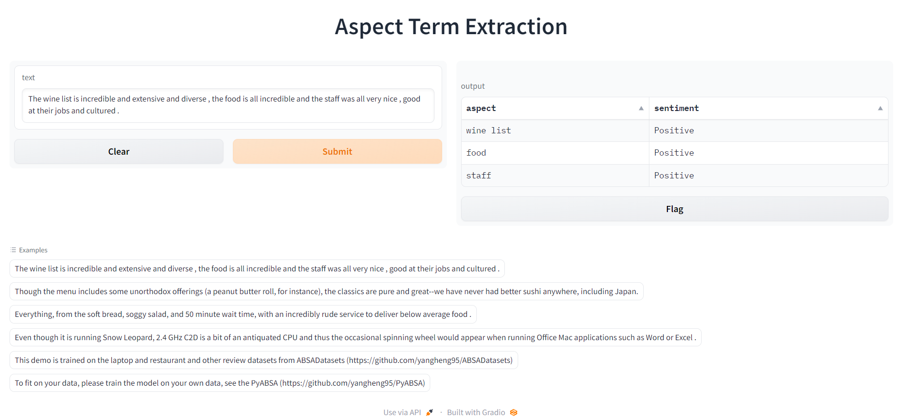

# Aspect term extraction and sentiment classification

This Notebook is created and Run in colab by Devansh Mistry. Deployed on Gradio.

Just Open or clone in colab to use it. At end you will get Deployed version like this:

# This Notebook is using PyABSA library, Citation

    @article{YangL22,
      author    = {Heng Yang and
                   Ke Li},
      title     = {PyABSA: Open Framework for Aspect-based Sentiment Analysis},
      journal   = {CoRR},
      volume    = {abs/2208.01368},
      year      = {2022},
      url       = {https://doi.org/10.48550/arXiv.2208.01368},
      doi       = {10.48550/arXiv.2208.01368},
      eprinttype = {arXiv},
      eprint    = {2208.01368},
      timestamp = {Tue, 08 Nov 2022 21:46:32 +0100},
      biburl    = {https://dblp.org/rec/journals/corr/abs-2208-01368.bib},
      bibsource = {dblp computer science bibliography, https://dblp.org}
    }
